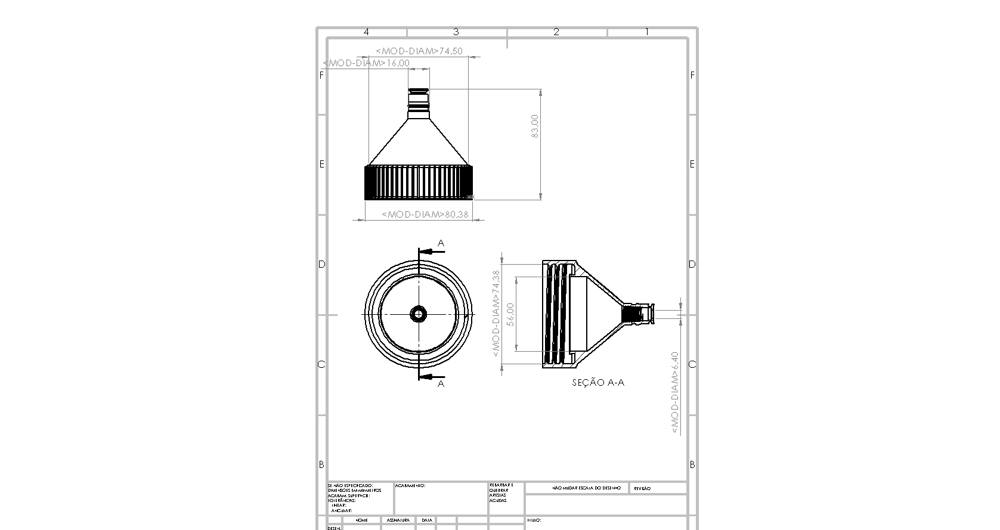
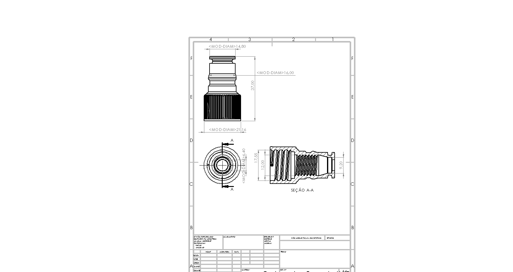

# 🍺 Projetos para Cervejaria — Modelos 3D

Peças e acessórios que desenvolvi para o meu processo cervejeiro caseiro: carbonatação forçada,
adaptadores, suportes de instrumentação e o sistema **Cerveja Fácil / AgroKeg**. Tudo modelado no
**SolidWorks** e pronto para **impressão 3D**.

---

## 💨 Carbonator — Cerveja Fácil / AgroKeg

Conjunto de carbonatação com tampa, base de gás, pinos com o-ring, porcas e mola. Existe uma
segunda montagem genérica do Carbonator (flexível e com espigão), além do modelo de teste de
tolerância.

| Caminho | Conteúdo |
|---|---|
| `Cerveja_Facil_AgroKeg/*.SLDPRT` | `Carbonator_AgK_Tampa`, `Carbonator_Base_AgK_Gas`, `Carbonator_AgK_Peq_Tampa`, `Carbonator_pino_com_oring`, `Carbonator_porca`, `Mola`, `PET_AgK_Tampa` e os o-rings |
| `Cerveja_Facil_AgroKeg/Montagem_CARBONATOR_Gas_AgK.SLDASM` | Montagem principal |
| `Cerveja_Facil_AgroKeg/STL/` | STLs prontos para fatiar |
| `Cerveja_Facil_AgroKeg/Desenhos/` | Desenhos técnicos (`.SLDDRW` + `.JPG`) |
| `Cerveja_Facil_AgroKeg/GX & FPP/` | Projetos do FlashPrint com posicionamento e suportes |

## 🧩 Carbonator (versão flexível / com espigão)

| Caminho | Conteúdo |
|---|---|
| `Carbonator - Copy/*.SLDPRT` / `.SLDASM` | Base, base com encaixe, porca para espigão, moldes de o-ring e o-rings |
| `Carbonator - Copy/STLs/` | STLs da montagem completa e da versão com espigão |
| `Carbonator - Copy/GX & FPP/` | Projetos FlashPrint prontos |

## 🧪 Acessórios e instrumentação

| Arquivo | O que é |
|---|---|
| `Calço para geladeira de parafuso 18mm` / `23mm` | Calços de regulagem/geladeira |
| `Direcionador_torneira_fermentador` | Direcionador de torneira para o fermentador |
| `Segurador_de_telinha_termometro` | Suporte da telinha do termômetro |
| `Sparge_peça` | Peça para o sistema de sparge |
| `tampa traseira` | Tampa traseira (`.SLDPRT`, `.STL`, `.STEP`) |

Cada peça existe normalmente em três versões: `.SLDPRT` (paramétrico), `.STL` (imprimir) e `.gx`/`.fpp`
(projeto do fatiador FlashPrint).

---

## 🖨️ Como usar

| Formato | Para quê |
|---|---|
| `.SLDPRT` / `.SLDASM` / `.SLDDRW` | Editar no SolidWorks (2017 SP3) |
| `.STL` | Fatiar e imprimir — **o GitHub mostra o visualizador 3D** ao abrir o arquivo |
| `.STEP` | Importar em qualquer CAD |
| `.gx` / `.fpp` | Projetos prontos do FlashPrint |

## ⚠️ Observações

Peças em contato com cerveja/alimento devem ser impressas em material e acabamento adequados
(ex.: PETG ou PP, com pós-processamento). Verifique a compatibilidade química e a vedação
antes de usar em contato direto com o líquido.

## 📄 Licença

[CC BY-NC-SA 4.0](LICENSE) — use, adapte e compartilhe dando o crédito, sem fins comerciais.
